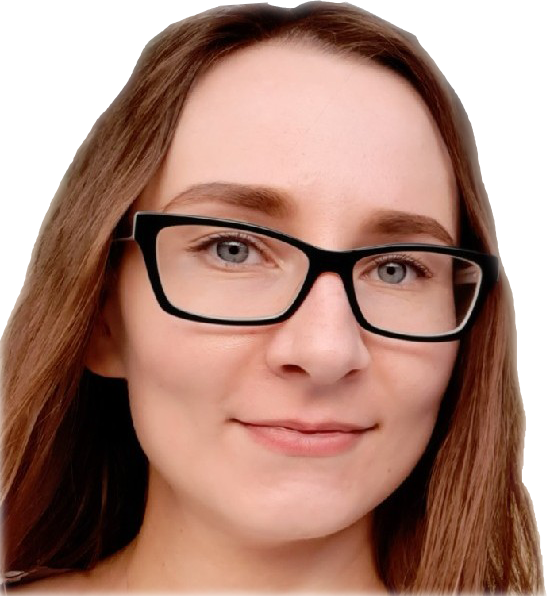

<!--  -->

# Daria Bataeva
## Contacts
* Phone number: +7 922 852 66 59
* Email: 79228526659@yandex.com
* Discord: Daria Bataeva (@dbataeva)
* GitHub accaunt: https://github.com/dbataeva
* Location: Moscow, Russia

## About me
I began my adventure in programming word in 2020 in [21 programming school](https://21-school.ru/). For the first year I was learning C language, then C++ language.
At last I decided to be a front-end developer and started studying JS [here](https://learn.javascript.ru/). Then I knew about [RS school](https://rs.school/) and I became a student there. I study [JS stage 0](https://rs.school/js-stage0/) and my aim is to be a super front-end developer.

## Skills
- JS, CSS, HTML5, TS, JSON, C/C++, STL
- OOP, Multiprocessing, Threading
- HTTP
- Docker, k8s, Nginx, Postman
- Git, Unix, Bash, Browser DevTools, Makefile

## Code example
    function multiply(a, b) {
      return (a * b);
    }

## Experience
My best JS projects are:
- [birds orchestra](https://dbataeva.github.io/birds_orchestra/) - let you know how birds sing and choose background sounds as you wishe
- [gallery](https://dbataeva.github.io/gallery/) - beautiful wolfs and fun phrases with animation
- [shopping list](https://dbataeva.github.io/shopping_list/) - check-list for base woman clothes
- [clock](https://dbataeva.github.io/clock/) - an interface that shows current time at a clock face
- [population and the city](https://dbataeva.github.io/population_and_the_city/) - let you know how much people live in Russian cities
- [canvas](https://dbataeva.github.io/canvas/) - you can draw right in your browser

My best C++ projects are:
- [webserver](https://github.com/dbataeva/webserver) - a group project to make our own HTTP server. My part of the project was to manage of kernel events, getting requests, form responses and preparation for CGI (MacOS)
- [ft_containers](https://github.com/dbataeva/ft_containers) - reimplementation of vector, stack, map and set template containers

My best C projects are: 
- [philosophers](https://github.com/dbataeva/philosophers) - a multithreading solution of a case of eating philosophers
- [cub3d](https://github.com/dbataeva/cub3d) - a 3D game from a first-person perspective using the Ray-Casting principles (MacOS)
- [so_long](https://github.com/dbataeva/so_long) - a 2D game (Linux)

## Education
* [21 programming school](https://21-school.ru/). October 2020 - present
* [RS school](https://rs.school/). June 2022 - present
* Orenburg State Medical University. 2009 - 2017

## Languages
* English - B1 (I continue study under a teacher)
* Russian - native
